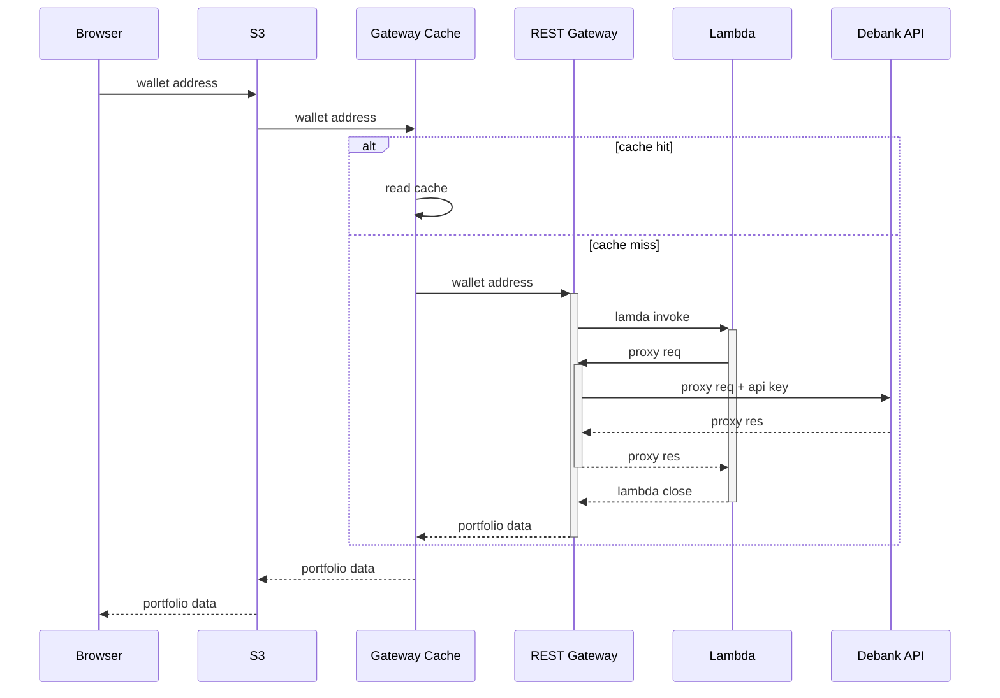

# Architecture

Portfolio API

```mermaid
sequenceDiagram
  participant b as Browser
  participant s as S3
  participant gc as Gateway Cache
  participant g as REST Gateway
  participant l as Lambda
  participant d as Debank API
  b ->> s: wallet address
  s ->> gc: wallet address
  alt cache hit
  gc ->> gc: read cache
  else cache miss
  gc ->>+ g: wallet address
  g ->>+l: lamda invoke
  l ->>+ g: proxy req
  g ->> d: proxy req + api key
  d -->> g: proxy res
  g -->>- l: proxy res
  l -->>- g: lambda close
  g -->>- gc: portfolio data
  end
  gc -->> s: portfolio data
  s -->> b: portfolio data
```
